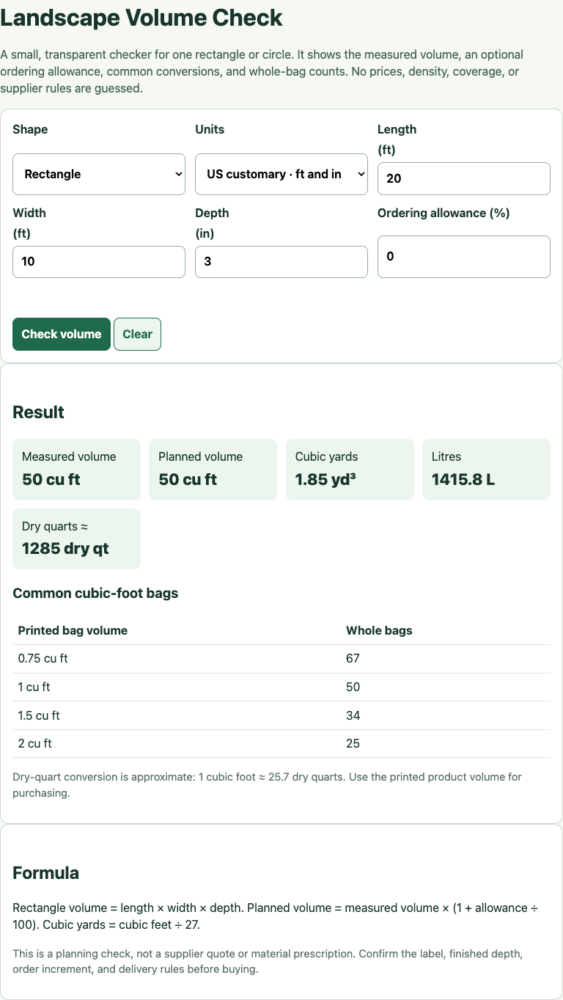

# CoverCalc Pro Landscape Quantity Kit

Open, dependency-free building blocks for checking landscape material quantities before a purchase or quote. The kit is aimed at homeowners and small contractors working with mulch, soil, compost, pine straw, raised beds, and container media.

The companion calculators at [covercalcpro.com](https://covercalcpro.com/?utm_source=github&utm_medium=referral&utm_campaign=covercalcpro_kit) turn the same inputs into browser-based order checks. This repository keeps the reusable field model, formulas, and a small standalone volume checker inspectable.

**[Use the online calculators](https://covercalcpro.com/?utm_source=github&utm_medium=referral&utm_campaign=covercalcpro_kit#calculator)** · **[Try this kit locally](docs/TRY-IT.md)** · **[Embed a calculator](docs/EMBED.md)** · [Report a calculation issue](https://github.com/LydiaTools/covercalcpro-landscape-quantity-kit/issues)

## See one calculation



This is a screenshot of the actual HTML tool using a documented arithmetic example, not a supplier recommendation. A 20 ft × 10 ft rectangle at 3 in depth and 0% allowance gives **50 cu ft**, **1.85 yd³** after display rounding, and **25 bags** if each bag contains 2 cu ft. The dimensions and allowance are chosen for the example; use your measurements and product label when ordering.

## Included

- `data/landscape-calculator-fields.csv` — a compact field dictionary for area, container, material, allowance, bag, density, and price inputs.
- `data/mulch-coverage-tables.csv` — a consolidated CSV export of the live depth-coverage and bag-quantity tables, with source URLs on every row.
- `tools/landscape-volume-check.html` — a zero-dependency browser tool for rectangle and circle volumes, allowances, cubic-yard/litre conversions, and common bag-size checks.
- `docs/quantity-checklist.md` — a supplier-ready checklist that separates measured geometry from product facts and quoted prices.
- `examples/hosted-mulch-embed.html` — a responsive garden-blog example containing the live CoverCalc Pro mulch iframe, with a fallback link and a reproducible calculation.
- `docs/EMBED.md` — copy-and-paste installation, a self-hosting alternative using the existing local checker, and the privacy and hosting differences between the two.

Open the HTML file directly in a modern browser. It does not send measurements anywhere, require an account, or guess prices, density, coverage, or supplier minimums.

```sh
git clone https://github.com/LydiaTools/covercalcpro-landscape-quantity-kit.git
cd covercalcpro-landscape-quantity-kit
```

Then open `tools/landscape-volume-check.html` in your browser. No build or package installation is required. The online calculators and the small local checker have different interfaces; this repository does not contain the whole production website.

## Formula notes

The tool deliberately exposes the calculation chain:

```text
rectangle volume = length × width × depth
circle volume = π × (diameter ÷ 2)² × depth
planned volume = measured volume × (1 + allowance ÷ 100)
cubic yards = cubic feet ÷ 27
litres = cubic feet × 28.316846592
whole bags = ceiling(planned volume ÷ printed bag volume)
```

For metric input, length, width or diameter and depth are converted to metres before geometry is calculated. The displayed dry-quart result is an approximate planning conversion of `1 cubic foot ≈ 25.7 dry quarts`; printed product volume remains the authority for bag counts.

No default price, density, bale coverage, or material prescription is embedded. Put those facts in from the label or supplier quote you actually have.

The mulch CSV contains only rows shown in the two linked CoverCalc Pro charts. Blank fields mean that a value is not supplied for that row; the file does not interpolate omitted depths or invent product facts.

## Why the fields stay separate

Measured area or container geometry answers “how much space is there?” Product volume, density, coverage, order increments, and prices answer “how will this supplier sell it?” Keeping those layers separate makes a result easier to audit and prevents a planning example from looking like a universal product claim.

## Limitations: what this kit does not do

- The standalone checker calculates one rectangle or circle at a uniform depth per run. It does not measure a photo, map an irregular slope, combine multiple sections or choose a suitable application depth.
- It checks volume and whole bags, not a compost-pile recipe, nutrient plan, drainage design or structural load. It does not decide whether a material is appropriate for your project.
- It does not provide current prices, delivery fees, availability or a supplier's minimum order. It also does not estimate weight without a separate product-specific density calculation.
- Bag counts cover the displayed cubic-foot sizes. Use the volume printed on your actual package; a bag's weight alone does not establish its volume. Dry-quart output is approximate and displayed results are rounded.
- The CSV tables are a bounded export of the linked charts, not a product database or a record of user projects. They do not prove search demand, market prices or universally recommended depths.
- This is a small reusable kit, not the full production website. It contains no account integration, ordering or payment workflow, and no promise of project outcomes or search rankings.

For a reusable ordering record, keep your measurements, chosen depth and actual supplier facts separate in the [quantity checklist](docs/quantity-checklist.md).

## Embed without a build step

For a garden blog or supplier guide, follow [the embed instructions](docs/EMBED.md). The hosted frame checks an already measured area and added depth; the standalone checker in this repository uses rectangle or circle dimensions. They are different tools, not interchangeable copies of the production website.

The example starts with blank inputs, makes no product or price recommendation, and keeps a normal visible link to the full calculator. It does not require a backlink, an account, an API key, or analytics code. The hosted frame requires internet access; the existing standalone checker can run locally or on your own server.

## Check the integration examples

The tools still require no Node.js or dependency installation. Contributors with Node.js 20 or later can run the small static integration test suite:

```sh
node --test tests/*.test.mjs
```

These tests check the install snippets, local paths, frame titles, fallback links, and absence of tracker or credential code in the example. They do not prove third-party installs, traffic, or results in every website builder. Use the browser checks in [EMBED.md](docs/EMBED.md#test-before-publishing) before publishing your own page.

## License

MIT. See [LICENSE](LICENSE).

## Feedback and contributions

See [CONTRIBUTING.md](CONTRIBUTING.md) for reproducible calculation reports, source-backed data corrections, and small changes. If the kit helps with a real project, a Star is welcome; using it does not require one.
